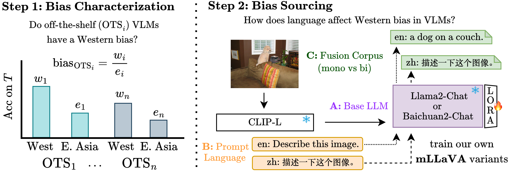

# See It from My Perspective: How Language Affects Cultural Bias in Image Understanding (ICLR 2025)

Amith Ananthram, Elias Stengel-Eskin, Mohit Bansal, Kathleen McKeown

Paper: [https://openreview.net/forum?id=Xbl6t6zxZs](https://openreview.net/forum?id=Xbl6t6zxZs)

This codebase allows replication of the experiments in our paper which characterize and root cause Western bias in VLMs.  

It depends on [our fork of the fantastic LLaVA repository](https://anonymous.4open.science/r/mLLaVA) which we have adapted to support using the [Baichuan2](Baichuan2) family of LLMs as the base LLM.  If you're only interested in using our monolingual/bilingual Llama2 and Baichuan2 based VLMs, you only need to clone our LLaVA fork (or you can simply use the models directly via HuggingFace (simply search for our paper there).


## Usage



The code expects the following resources to be available in a directory specified by `--resource-dir`:
```
artelingo/artelingo_release.csv
wikiart
dollar/dataset_dollarstreet
```

To produce generations for a specific task and model, run:

```bash
python 1_run_vlm_cultural_bias_inference.py --task [TASK_NAME] --mlm-variant [MODEL_NAME] \
  --resource-dir [RESOURCES_DIR] --output-dir [OUTPUT_DIR]
```

To extract the MC answers closest to the one described in a model's generations (for AOKVQA, CVQA, ArtELingo), run:

```bash
python 2_extract_mcvqa_artelingo_selections.py --output-dir [OUTPUT_DIR]
```

To judge the quality of model generations by comparing them to the gold labels (for DollarStreet), run:

```bash
python 3_judge_dollarstreet_with_prometheus.py --model 8x7b prompt-file prompts/prometheus_dollar.json \
  --judgment-lang en --temperature 1.0 --top-p 0.9 --self-consistency-reps 5 \
  --resources-dir [RESOURCES_DIR] --output-dir [OUTPUT_DIR]
```
