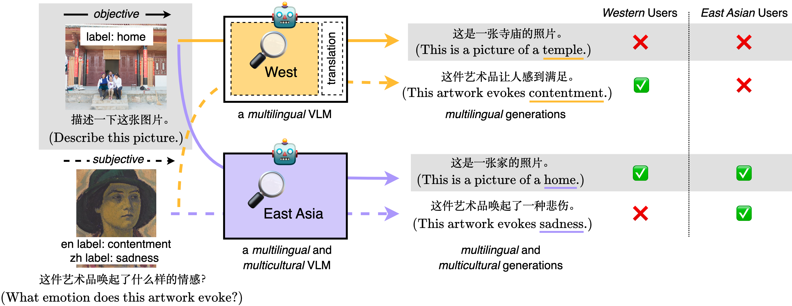

# See It from My Perspective: Diagnosing the Western Cultural Bias of Large Vision-Language Models in Image Understanding

Amith Ananthram, Elias Stengel-Eskin, Carl Vondrick, Mohit Bansal, Kathleen McKeown

This codebase allows replication of the experiments in our paper which characterize and root cause Western bias in VLMs.  
It depends on [our fork of the fantastic LLaVA repository](https://github.com/amith-ananthram/mLLaVA/tree/main?tab=readme-ov-file) which we have adapted to support using the [Baichuan2](Baichuan2) family of LLMs as the base LLM.  If you're only interested in using our monolingual/bilingual VLMs, you only need to clone our LLaVA fork.

